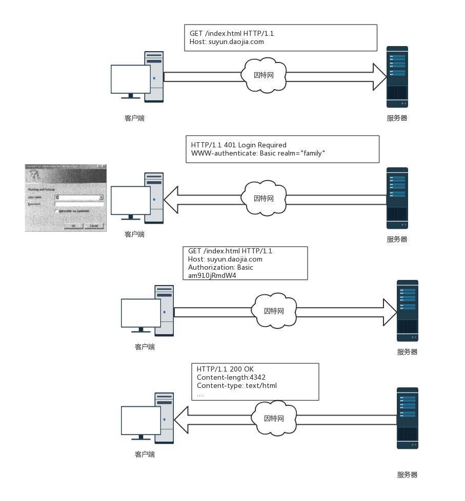
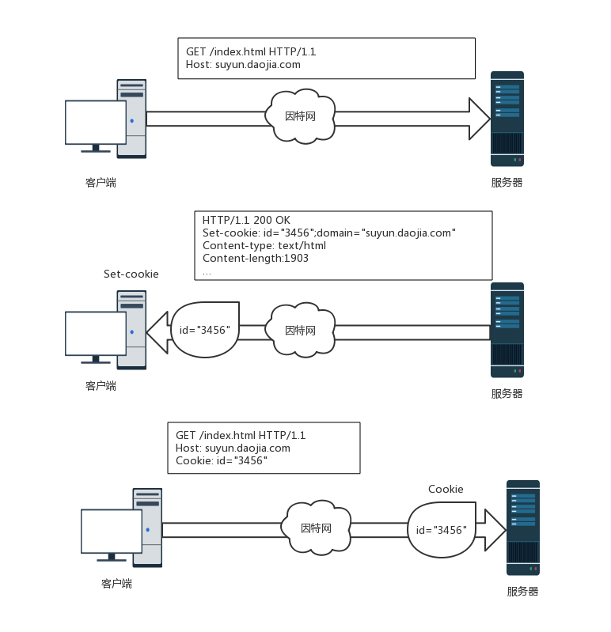

## 为什么HTTP要具备识别用户的能力
 web服务器为了向用户提供更精准，更个性化的服务，需要具备识别用户客户端的能力。本文主要对HTTP如何区分不同的用户，不同的客户端的方式方法做一个总结。
## HTTP首部
最容易想到的方法就是添加HTTP首部。我们来看一下几个相关的首部：
### from
`from:"xxxx@gmail.com"`通过在请求头部添加该字段，服务器通过请求来源的email地址来区分用户。理想的情况下，该方案不失为一种思路。但实际用户的email很容易会被人获取到，并被用来向用户发送垃圾邮件。所以很少有人使用这种方式。
### referer
`referer:https://www.google.com/`。referer字段能够说明用户是从什么网站过来的。但是没办法做到区分是哪个用户。
### user-agent
`user-agent:Mozilla/5.0 (Windows NT 6.1; Win64; x64) AppleWebKit/537.36 (KHTML, like Gecko) Chrome/59.0.3071.115 Safari/537.36`该字段也存在同样的问题，虽然能区分用户的浏览器，操作系统等信息，但仍旧无法区分是哪个用户。
### 高级首部字段
authorization、Client-IP、cookie等。其中authorization和cookie，我们在下面的部分会有详细说明。
## 通过客户端IP来区分
我们知道每个客户端在与服务器通信的建立通信的时候，必然会用到IP地址的。在客户端IP和客户端是一对一的情况下，确实可以使用客户端IP来作为区分客户端的依据。但现实是，多个客户端可以公用一个IP地址，有的IP地址是动态分配的，甚至IP可以伪造的。所以现实决定了使用客户端IP来识别用户也不是一个有效的方式。
## 使用fat URL
fat URL 光看名字大家就能猜出一二了。无非就是web服务器为用户动态生成一个超链接，超链接上插入了用来识别每个用户的标识符。这样，用户访问了带有标识符的链接时，服务器会根据对应的标识符来向用户显示对应的内容。但这种方式的问题也很明显：1.用户的个人信息可能会显示给别人2.如果用户跳出了链接，所相关的信息都会丢失。
## 用户登录认证
这种方式是服务器主动要求用户提供个人账号和密码等信息。用户验证通过后，服务器就可以针对该用户提供个性化的服务了。具体流程就是客户端浏览器向服务器发起请求，服务器回送一个401 login request的响应，响应头设置www-auhorization字段，要求用户提供账号信息。用户填写完信息，将认证信息添加到autorization字段中，再次发起请求。服务器验证通过，并将资源返回给用户。

但也有一个问题就是，如果用户访问多个网站，每个网站都需要用户提供用户账号信息，用户需要记住多个账号密码，如果网站多了，用户会被记忆这么多账号密码逼疯的。

## 使用cookie
cookie不存在上面几种方法的问题，是实现客户端识别和持久会话的最好方式。cookie在web应用中十分重要，HTTP中也定义了相关的首部。我们来仔细看一下cookie。
### cookie的工作原理
服务器如果希望用户再次访问的时候，可以正确识别出该用户。怎么办？很简单，服务器给客户端贴一个标签，这样当客户端下次再请求的时候，服务器只需要将客户端带过来的标签和服务器端记录的标签进行比对，就可以识别出该用户。我们来梳理一下基本的流程。

首次访问服务器时，服务器对客户端一无所知。
服务器希望客户端下次访问时，因此在http响应中，使用`set-cookie`将一些用来识别用户的标记返回给客户端。
客户端收到响应后，将收集到的`set-cookie`中的这些识别标记存储成cookie文件。客户端再次请求服务器时，会查找存储的cookie，将所有domain，path，security都匹配且未过期的cookie收集起来，一并发给服务器。服务器从收到的cookie信息里就可以正确识别出是哪个客户端了。

### cookie的属性
在介绍cookie的工作原理时，我们提到了cookie的属性，如domain，path，security等。下面我们介绍一下cookie有哪些主要的属性。
- **name=value**。该属性是必需的，用来存储用户的信息。例如 cookie-id=371513。
- **domain**。用来指定客户端发送请求时可以发往的服务器。例如，客户端有2个cookie，内容分别为：`username=ant;domain=suyun.com`,`nick=xiao;domain=daojia.com`，客户端访问`suyun.com`时，请求头中只会包含前者,像这样`Cookie:username=ant;`。
- **path**。请求的资源路径中包含path时，才能发送cookie。例如客户端由两个cookie，`username=ant;domain=suyun.com;path=/`和`age=20;domain=suyun.com;path=/order`,如果访问的页面是`http://suyun.com/index.html`，此时发送的cookie为：`Cookie:username=ant`,如果访问的页面为`http://suyun.com/order/orderdetail.html`，发送的cookie为`Cookie:username=ant;age=20`。可以看到，`path=/order`可以携带从根路径到指定路径所有的cookie。
- **secure** 。如果包含了secure，只有在HTTP使用SSL安全连接时才会发送cookie。
- **expires**。该属性会指定一个日期字符串，用来定义cookie的实际生存期。一旦到了过期日期，就不再存储或发送该cookie了。如果不指定该属性，cookie会在会话结束后失效。下面是一个指定了过期日期的例子`username=ant;domain=suyun.com;expires=Sat, 05 Aug 2017 17:00:07 -0000`
- **HttpOnly** 如果指定了HttpOnly，则不允许js使用document.cookie，XHR和Requset API访问cookie以防范XSS攻击。 例如，`Set-Cookie:__Host-user_session_same_site=eGOAT6axP7F1cljH1JMv62MHd5CVQTLEpomAUwTla_5Vfero;HttpOnly`
- **Max-Age** 该属性指定一个相对时间，用来指定cookie距离过期剩余的秒数。老浏览器不支持该属性（ie6，ie7，ie8）。如果该属性与expires同时出现，该属性的优先级高。示例，`Set-Cookie:dwf_sg_task_completion=False; expires=Mon, 21-Aug-2017 18:01:34 GMT; Max-Age=2592000; Path=/; secure`
## 总结
为了识别客户端，为用户提供个性化的服务。HTTP为我们提供了一些方法。这些方式方法中cookie的方式最常用也最好。cookie的本质是在客户端存储了一份用户的状态。通过设置cookie的属性我们可以控制cookie发往哪些服务器，决定cookie的过期时间等。