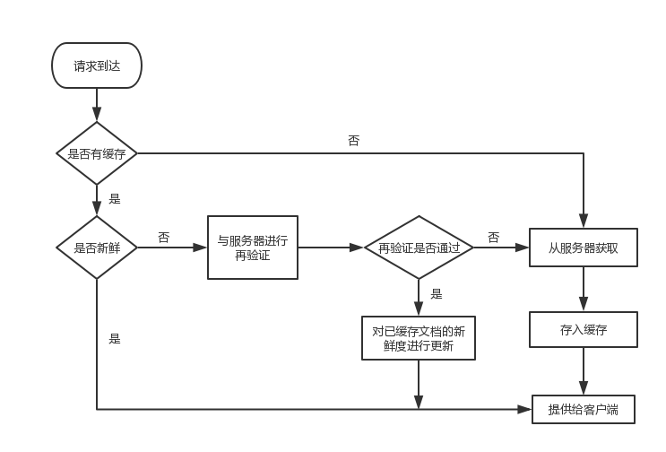
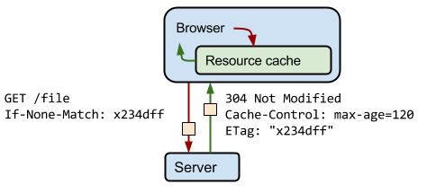
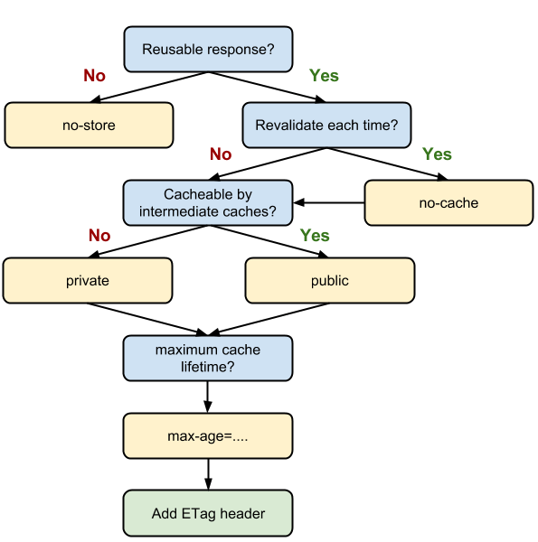

# 什么是web缓存
自动保存常见文档副本的HTTP设备。当web请求到达缓存时，如果本地有“已缓存的”副本，就可以从本地存储设备而不是原始服务器中提取这个文档。
# 使用缓存有哪些优点
- 减少了冗余的数据传输
- 环节了网络瓶颈的问题
- 降低了对原始服务器的要求
- 降低了距离时延
# 缓存命中和未命中
可以用已有的副本为某些到达缓存的请求提供服务。这成为缓存命中。如果一些到达缓存的请求没有副本可用，而被转发给原始服务器。这称为缓存未命中。
# 再验证
原始服务器的内容可能发生变化，缓存要不时对其进行检测，看看它们保存的副本是否仍是服务器上的最新版本。这些新鲜度检测被称为HTTP再验证。
缓存对缓存的副本进行再验证时，会向原始服务器发送一个小的再验证请求。如果内容没有变化，服务器会以一个小的304 Not Modified进行响应。只要缓存知道副本仍然有效，就会再次将副本标识为新鲜的，并将副本提供给客户端 ，这称作再验证命中或缓慢命中。这种情况下确实要与服务器进行核对，所以会比单纯的缓存命中要慢，但它没有从服务器获取对象数据，所以要比缓存未命中快一些。
HTTP提供了几个用来对缓存对象进行再验证的工具，其中最常用的是if-Modified-Since首部。将这个首部添加到Get请求中去，就可以告诉服务器，只有在缓存了对象的副本之后，又对其进行了修改的情况下，才发送此对象。
以下列出了3种情况下服务器收到GET if-Modified-Since请求时会发生的情况：
- 再验证命中
如果服务器对象未没修改，服务器会向客户端发送一个小的HTTP 304 Not Modified响应。
- 再验证未命中
如果服务器对象与已缓存副本不同，服务器向客户端发出一条普通的、带有完整内容的HTTP 200 OK响应。
- 对象被删除
如果服务器对象已经删除了，服务器就回送一个404 Not Found响应，缓存也会将其副本删除。
# 命中率
有缓存提供服务的请求所占的比例被称为缓存命中率（或文档命中率）。实际得到的命中率与缓存的大小、缓存用户兴趣点相似性、缓存数据的变化或个性化频率，以及如何配置缓存有关。
# 字节命中率
字节命中率表示的是缓存提供的字节在传输的所有字节中所占的比例。通过这种度量方式，可以得知节省流量的程度。例如，100%的字节命中率说明每个字节都来自缓存。
文档命中率和字节命中率对缓存性能的评估都很有用。文档命中率说明阻止了多少通往外部网络的web事务。提高文档命中率对降低整体延迟很有好处。字节命中率说明阻止了多少字节流向因特网。提高字节命中率对节省带宽有利。
# 如何区分命中与未命中？
HTTP并没有提供一种手段来区分响应是缓存命中还是访问的原始服务器得到的。因为两种情况下响应码都是200 OK。
客户端有一种方法可以判断响应是否来自缓存。就是使用Date首部。将响应中Date首部的值与当前时间进行比较，如果响应中的日期值早于当前时间，客户端通常就可以认为响应来自缓存。
客户端也可以通过Age首部来检测缓存的响应，通过这个首部可以分辨出这条响应的使用期。
# 缓存的拓扑结构
缓存可以是单个用户专用的，也可以是数千名用户共享的。专用缓存被称为私有缓存。共享的缓存被称为公有缓存。
## 私有缓存
私有缓存是个人的缓存，包含了单个用户最常用的页面。web浏览器中有内建的私有缓存——大多数浏览器都会将常用文档缓存在你个人电脑的磁盘和内存中，并且允许用户去配置缓存的的大小和各种设置。
## 公有代理缓存
公用缓存中包含了某个用户团体的常用页面。公有缓存是特殊的共享代理服务器，被称为缓存代理服务器。代理缓存会从本地缓存中提供文档，或者代表用户与服务器进行联系。他可以接收来自多个用户的访问，所以通过它可以根号的减少冗余流量。
## 代理缓存的层次结构
在实际中，实现层次化的缓存是很有意义的。其基本思想是在靠近客户端的地方使用小型廉价缓存，而在更高层次中，则逐步采用更大、功能更强的缓存来装载多用户共享的文档。
在缓存层次结构很深的情况下，请求可能要穿过很长一溜缓存，每个拦截代理都会增加一些性能损耗，当代理链路变得很长的时候，性能损耗会变得非常明显。
## 网状缓存、内容路由以及对等缓存
有些网络结构会构建复杂的网状缓存。网状缓存中的代理缓存之间会以更加复杂的方式进行对话，做出动态的缓存通信决策，决定与哪个父缓存进行对话，或者决定彻底绕开缓存，直接连接原始服务器。这种代理缓存会决定选择何种路由对内容进行访问、管理和传送，因此可将其成为内容路由器。
缓存之间这些更为复杂的关系允许不同的组织互为对等实体，将它们的缓存连接起来以实现共赢。提供可选的对等支持的缓存被称为兄弟缓存。
# 缓存的处理步骤

## 接收
缓存从网络中读取抵达的请求报文
## 解析
对报文进行解析，提取URL和各种首部。
## 查找
查看是否有本地缓存可用，如果没有，就从服务器获取一份副本并保存在本地。
## 新鲜度检测
查看已缓存副本是否足够新鲜，如果不是，就询问服务是否有更新。
## 创建响应
使用新的首部和已缓存的主题来构建一条响应报文。
## 发送
缓存通过网络将相应发回给客户端。
## 日志
缓存可选地创建一个资质文件条目描述这个事务。
# 保持副本的新鲜
HTTP有一些简单的机制可以在不要求服务器记住有哪些缓存拥有其文档副本的情况下，保持已缓存数据与服务器之间充分一致。这些机制是文档过期和服务器再验证。
## 文档过期
通过特殊的HTTP Cache-control首部和Expires 首部，HTTP让原始服务器向每个文档附加了一个“过期日期”。在缓存文档过期之前，缓存可以以任意频率使用这些副本，而无需与服务器联系。
### 使用expires指定过期日期
```
Expires:Sat, 07 Jul 2018 15:29:33 GMT
```
指定了一个绝对的过期日期 `Sat, 07 Jul 2018 15:29:33 GMT`，如果该日期过了，说明文档不再新鲜了。
### 使用Cache-control指定过期日期
```
Cache-Control:max-age=31536000
```
max-age值定义了文档的最大有效期为31536000（秒）
## 服务器再验证
已缓存的文档过期并不是它与原始服务器上的文档不一致了，只是意味着到了要进行核对的时间了。说明缓存需要访问服务器看文档是否发生了变化。
- 如果再验证显示内容发生了变化，缓存会获取一份新的文档替换缓存中的旧文档，并将文档发送给客户端。
- 如果再验证显示内容未发生变化，缓存只需要获取新的首部（包括一个新的过期日期），并对缓存中的首部进行更新就行了。
### 用条件方法进行再验证
HTTP在GET请求报文中添加一些特殊的条件首部，就可以发起条件GET，只有条件为`true`时，web服务器才会返回对象。所有的条件首部都以`If-`开头。对缓存再验证来说最有用的两个首部是`If-Modified-Since`和`If-None-Match`。
#### If-Modified-Since
其语法如下：
```
If-Modified-Since:Mon, 10 Jul 2017 07:00:25 GMT
```
如果在指定日期后，文档被修改了，`If-Modified-Since`条件就为`true`，服务器就会执行客户端的请求，返回带有新首部的新文档。如果条件为`false`，说明文档没有发生变化，服务器只需要向客户端返回一个小的304响应报文。`If-Modified-Since`通常与`Last-Modified`结合使用，`If-Modified-Since`所带的日期参数就是通过`Last-Modified`来指定的。

### If-None-Match
有些情况下仅使用最后修改日期进行再验证是不够的。例如，有些文档可能会周期性地重写，但实际包含的数据常常是一样的，虽然日期会发生变化，但内容没有变化。为了解决这些问题，HTTP使用`If-None-Match`对称为实体标签（ETag）的“版本标识符”进行比较。

`If-None-Match`还可以指定多个Etag，告诉服务器，带有这些ETag的文档在缓存中已经有了。
```
If-None-Match: "v2.6"
If-None-Match: "v2.6","v2.5"
```
### 强验证和弱验证
有时候服务器希望对文档进行一些非实质性或不重要的修改时，不要使所有的已缓存副本都失效。HTTP/1.1支持“弱验证”，如果只对内容进行了少量修改，就可以认为是相等的。服务器会用前缀"w/"来标识弱验证器。
```
ETag:W/"SQ4MC886Xlop1W0MiuTXuDwxLX8="
If-None-Match:W/"SQ4MC886Xlop1W0MiuTXuDwxLX8="
```
### Etag和Last-Modified的使用
如果服务器回送了一个`Etag`，HTTP/1.1客户端必须使用`If-None-Match`。如果服务器回送了一个`Last-Modified`值，客户端需要使用`If-Modified-Since`。如果`Etag`和`Last-Modified`都提供了，客户端应该使用`If-None-Match`和`If-Modified-Since`两种验证方案。如果HTTP1/1.1缓存或服务器收到的请求既带有`If-None-Match`首部，也带有`If-Modified-Since`首部，那么只有两个条件都满足，才能返回`304 Not Modified`响应。
# Cache-Control 首部
每个资源都可通过`Cache-Control` HTTP 标头定义其缓存策略。`Cache-Control` 指令控制谁在什么条件下可以缓存响应以及可以缓存多久。
## Request Cache-Control
- Cache-Control: max-age=<seconds>
- Cache-Control: max-stale[=<seconds>]
- Cache-Control: min-fresh=<seconds>
- Cache-Control: no-cache 
- Cache-Control: no-store
- Cache-Control: no-transform
- Cache-Control: only-if-cached
## Response Cache-Control
- Cache-Control: must-revalidate
- Cache-Control: no-cache
- Cache-Control: no-store
- Cache-Control: no-transform
- Cache-Control: public
- Cache-Control: private
- Cache-Control: proxy-revalidate
- Cache-Control: max-age=<seconds>
- Cache-Control: s-maxage=<seconds>

## Cache-Control 指令的含义
> - public 数据内容可以被任何缓存保存起来
> - private 数据内容只能被储存到私有的cache，仅对某个用户有效，不能共享
> - no-cache 可以缓存，但是只有在跟WEB服务器验证了其有效后，才能返回给客户端
> - no-store 请求和响应都不会被缓存
> - only-if-cached 告知缓存者,我希望内容来自缓存，我并不关心被缓存响应,是否是新鲜的.
> - max-age=<seconds> 本响应包含的对象的过期时间
> - s-maxage=<seconds> 与max-age的唯一区别是,s-maxage仅仅应用于共享缓存.另外,s-maxage的优先级要高于max-age.
> - max-stale[=<seconds>] 允许读取过期时间小于max-stale 值的缓存对象。
> - min-fresh=<seconds> 接受其max-age生命期大于其当前时间 跟 min-fresh 值之和的缓存对象
> - must-revalidate 不允许使用过期的缓存数据，必须和原来的服务器确定是否为最新数据。
> - proxy-revalidate 与must-revalidate类似，区别在于：proxy-revalidate只用于共享缓存
> - no-transform 不要更改媒体类型,比如jpg,被你改成png
# 定义最佳 Cache-Control 策略

按照以上决策树为您的应用使用的特定资源或一组资源确定最佳缓存策略。在理想的情况下，您的目标应该是在客户端上缓存尽可能多的响应，缓存尽可能长的时间，并且为每个响应提供验证令牌，以实现高效的重新验证。
# 制定缓存策略的一些技巧
- 使用一致的网址：如果您在不同的网址上提供相同的内容，将会多次获取和存储这些内容。提示：请注意，网址区分大小写。
- 确保服务器提供验证令牌 (ETag)：有了验证令牌，当服务器上的资源未发生变化时，就不需要传送相同的字节。
- 确定中间缓存可以缓存哪些资源：对所有用户的响应完全相同的资源非常适合由 CDN 以及其他中间缓存进行缓存。
- 为每个资源确定最佳缓存周期：不同的资源可能有不同的更新要求。为每个资源审核并确定合适的 max-age。
- 确定最适合您的网站的缓存层次结构：您可以通过为 HTML 文档组合使用包含内容指纹的资源网址和短时间或 no-cache 周期，来控制客户端获取更新的速度。
- 最大限度减少搅动：某些资源的更新比其他资源频繁。如果资源的特定部分（例如 JavaScript 函数或 CSS 样式集）会经常更新，可以考虑将其代码作为单独的文件提供。这样一来，每次获取更新时，其余内容（例如变化不是很频繁的内容库代码）可以从缓存获取，从而最大限度减少下载的内容大小。